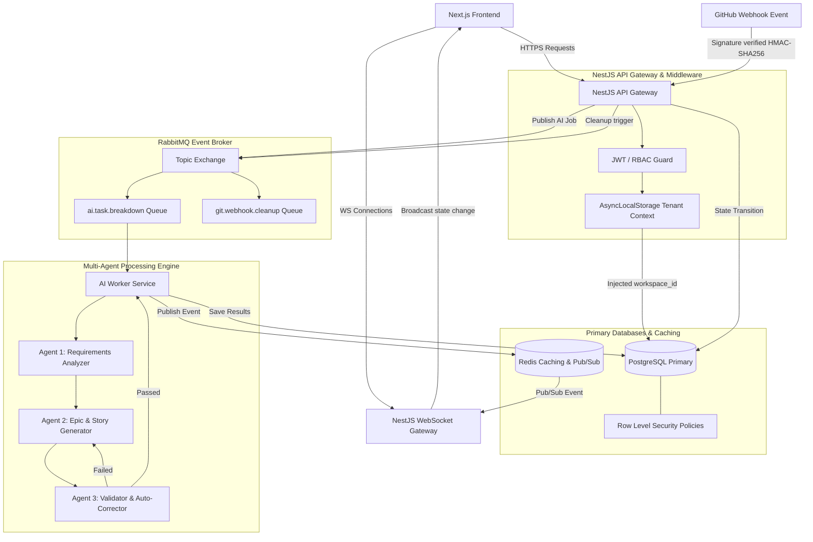

# SequenceJira: System Architecture & Technical Specification

This document provides a production-grade, deeply technical architectural specification for **SequenceJira**—an AI-first, real-time task management SaaS designed for developers and product teams. It covers multi-tenancy isolation, multi-agent AI pipeline design, WebSocket-based real-time state synchronization, developer-centric webhook integrations, and a relational PostgreSQL database schema.

---

## System Topology & Data Flow

Below is the high-level system topology illustrating the flow of client requests, background AI processing, real-time notifications, and Git integrations.



---

## 1. Core Architecture & Multi-Tenancy

SequenceJira utilizes a **Logical Separation** multi-tenancy model. All tenants (Workspaces) share the same PostgreSQL database instance and schemas, but data isolation is strictly enforced at the database query level using a `workspace_id` foreign key on every tenant-owned table.

### 1.1 Tenant Isolation with `AsyncLocalStorage`

To prevent data leaks (cross-tenant contamination), developers should not manually append `WHERE workspace_id = x` filters to every SQL query. Instead, the request lifecycle is intercepted to dynamically extract and bind the tenant context.

#### Request Flow:
1. **Extraction**: An HTTP middleware intercepts incoming requests and extracts the `workspace_id` from either a customized header (`x-workspace-id`) or decodes the authenticated user's JWT payload containing their active memberships.
2. **Context Binding**: The middleware instantiates a context object and stores it within Node's `AsyncLocalStorage` execution context.
3. **Automated Query Scoping**: An ORM interceptor (e.g., Prisma Client Extensions or TypeORM Subscriber) retrieves the current `workspace_id` from storage and automatically modifies the outbound database queries.

#### Execution Context Middleware (TypeScript / NestJS Example)
```typescript
// tenant.context.ts
import { AsyncLocalStorage } from 'async_hooks';

export interface TenantContext {
  workspaceId: string;
  userId: string;
}

export const tenantStorage = new AsyncLocalStorage<TenantContext>();
```

```typescript
// tenant.middleware.ts
import { Injectable, NestMiddleware, UnauthorizedException } from '@nestjs/common';
import { Request, Response, NextFunction } from 'express';
import { tenantStorage } from './tenant.context';
import * as jwt from 'jsonwebtoken';

@Injectable()
export class TenantMiddleware implements NestMiddleware {
  use(req: Request, res: Response, next: NextFunction) {
    const authHeader = req.headers.authorization;
    const workspaceIdHeader = req.headers['x-workspace-id'] as string;

    if (!authHeader || !authHeader.startsWith('Bearer ')) {
      return next(); // Let AuthGuard handle unauthenticated requests
    }

    try {
      const token = authHeader.split(' ')[1];
      const decoded = jwt.verify(token, process.env.JWT_SECRET) as any;
      const userId = decoded.sub;

      // Ensure the user has access to the requested workspace
      const userWorkspaces = decoded.workspaces || [];
      if (workspaceIdHeader && !userWorkspaces.includes(workspaceIdHeader)) {
        throw new UnauthorizedException('Access to this workspace is denied.');
      }

      const context: TenantContext = {
        workspaceId: workspaceIdHeader || userWorkspaces[0], // fallback to default
        userId,
      };

      // Run subsequent handlers inside the AsyncLocalStorage context
      tenantStorage.run(context, () => {
        next();
      });
    } catch (err) {
      throw new UnauthorizedException('Invalid or expired authentication session.');
    }
  }
}
```

#### Scoping Queries dynamically via PostgreSQL Row Level Security (RLS)
For absolute safety, Row Level Security is enabled directly in the PostgreSQL engine:

```sql
-- 1. Enable RLS on the tasks table
ALTER TABLE tasks ENABLE ROW LEVEL SECURITY;

-- 2. Create the isolation policy
CREATE POLICY task_workspace_isolation ON tasks
    FOR ALL
    USING (workspace_id = NULLIF(current_setting('app.current_workspace_id', true), '')::uuid);
```

Before executing any database transaction, the application pool must bind the local tenant parameter:
```typescript
// db-transaction.ts
import { PrismaClient } from '@prisma/client';
import { tenantStorage } from './tenant.context';

const prisma = new PrismaClient();

export async function executeTenantQuery<T>(queryFn: (tx: any) => Promise<T>): Promise<T> {
  const context = tenantStorage.getStore();
  if (!context) {
    throw new Error('Tenant context missing in current thread execution.');
  }

  return await prisma.$transaction(async (tx) => {
    // Inject tenant identity into the local connection session context
    await tx.$executeRawUnsafe(
      `SET LOCAL app.current_workspace_id = '${context.workspaceId}';`
    );
    return await queryFn(tx);
  });
}
```

---

### 1.2 Role-Based Access Control (RBAC) Matrix

Users belong to Workspaces through a `workspace_members` join table, which holds a designated `role` column. The following matrix outlines permission enforcement levels:

| Feature / Resource Action | Owner | Admin | Developer | Client / Viewer |
| :--- | :---: | :---: | :---: | :---: |
| **Manage Billing & Delete Workspace** | Yes | No | No | No |
| **Manage Members & Change Roles** | Yes | Yes | No | No |
| **Integrate GitHub (Token Config)** | Yes | Yes | No | No |
| **Create/Edit Projects & Epics** | Yes | Yes | Yes | No |
| **Create/Assign/Update Tasks** | Yes | Yes | Yes | No |
| **Comment on Tasks** | Yes | Yes | Yes | Yes |
| **Trigger Multi-Agent AI Generation** | Yes | Yes | Yes | No |
| **Read Tasks & View Boards** | Yes | Yes | Yes | Yes |

#### Permission Guard Implementation Strategy
```typescript
// roles.decorator.ts
import { SetMetadata } from '@nestjs/common';
export const Roles = (...roles: string[]) => SetMetadata('roles', roles);
```

```typescript
// rbac.guard.ts
import { Injectable, CanActivate, ExecutionContext, ForbiddenException } from '@nestjs/common';
import { Reflector } from '@nestjs/core';
import { PrismaService } from '../prisma.service';
import { tenantStorage } from './tenant.context';

@Injectable()
export class RbacGuard implements CanActivate {
  constructor(
    private reflector: Reflector,
    private prisma: PrismaService
  ) {}

  async canActivate(context: ExecutionContext): Promise<boolean> {
    const requiredRoles = this.reflector.getAllAndOverride<string[]>('roles', [
      context.getHandler(),
      context.getClass(),
    ]);
    if (!requiredRoles) return true; // Public or unrestricted resource

    const store = tenantStorage.getStore();
    if (!store) throw new ForbiddenException('Tenant context not resolved.');

    // Fetch user's membership role in the specific workspace
    const member = await this.prisma.workspaceMember.findUnique({
      where: {
        workspaceId_userId: {
          workspaceId: store.workspaceId,
          userId: store.userId,
        },
      },
    });

    if (!member || !requiredRoles.includes(member.role)) {
      throw new ForbiddenException('Insufficient permissions within this workspace.');
    }

    return true;
  }
}
```

---

## 2. The Multi-Agent AI Pipeline (The USP)

The core value proposition is the ability to ingest a single, raw, unstructured product feature statement (e.g., *"Add Stripe integration for monthly subscriptions with a 14-day trial period"*) and generate detailed, architectural tasks, epics, and subtasks complete with technical scope and verification guidelines.

This is modeled as an **event-driven, asynchronous Multi-Agent process** mediated by a queue system to keep the web application highly responsive.

### 2.1 Agent Pipeline Architecture

```
User Prompt (e.g., "Add Stripe") 
       │
       ▼
[API Gateway] ──► Pushes job state "PENDING" to PG ──► Publishes payload to RabbitMQ
                                                                │
                                                                ▼
                                                        [RabbitMQ Consumer]
                                                                │
                                                                ▼
                                                 ┌───────────────────────────────┐
                                                 │       AI Worker Service       │
                                                 │                               │
                                                 │  [Agent 1: Requirements]       │
                                                 │       │                       │
                                                 │       ▼                       │
                                                 │  [Agent 2: Epic & Stories]    │
                                                 │       │                       │
                                                 │       ▼                       │
                                                 │  [Agent 3: Validator]         │
                                                 │       ├──► (Fails Validation) ┘ (Loop back)
                                                 │       └──► (Passes)           ┐
                                                 └───────────────────────────────┼
                                                                                 ▼
                                                                 Update PG Status to "COMPLETED"
                                                                 Store Epics & Tasks
                                                                 Publish notification to Redis
                                                                                 │
                                                                                 ▼
                                                                 Redis Pub/Sub triggering
                                                                 WebSocket Gateway response
                                                                                 │
                                                                                 ▼
                                                                 Client UI Board auto-updates
```

---

### 2.2 Agent Detail Breakdowns

#### Agent 1: Requirements Analyzer
*   **Role**: Technical Product Owner & Architect.
*   **Prompt Strategy**: Parses the raw input to generate technical scopes. It maps out dependencies, potential data migrations, security requirements, and UI modifications.
*   **Output**: Structured markdown including architectural impacts and required code layers.

#### Agent 2: Task Breakdown & Epic Generator
*   **Role**: Senior Engineering Lead.
*   **Prompt Strategy**: Consumes the output of Agent 1 and breaks it down into distinct Epics (broad features) and User Stories.
*   **Structured Output (JSON Schema)**:
```json
{
  "$schema": "http://json-schema.org/draft-07/schema#",
  "title": "EpicAndTaskBreakdown",
  "type": "object",
  "properties": {
    "epics": {
      "type": "array",
      "items": {
        "type": "object",
        "properties": {
          "title": { "type": "string" },
          "description": { "type": "string" },
          "tasks": {
            "type": "array",
            "items": {
              "type": "object",
              "properties": {
                "title": { "type": "string" },
                "description": { "type": "string" },
                "technicalNotes": { "type": "string" },
                "estimatedPoints": { "type": "integer", "enum": [1, 2, 3, 5, 8, 13] },
                "priority": { "type": "string", "enum": ["LOW", "MEDIUM", "HIGH", "CRITICAL"] },
                "acceptanceCriteria": {
                  "type": "array",
                  "items": { "type": "string" }
                }
              },
              "required": ["title", "description", "technicalNotes", "estimatedPoints", "priority", "acceptanceCriteria"]
            }
          }
        },
        "required": ["title", "description", "tasks"]
      }
    }
  },
  "required": ["epics"]
}
```

#### Agent 3: Targeted Self-Correction & Validation
*   **Role**: QA & Security Architect.
*   **Execution Logic**:
    1. Validates structural adherence to the schema.
    2. Executes structural validation: checks for missing technical dependencies (e.g., if a task mentions database writes, there must be a preceding migration task).
    3. Evaluates security/privacy gaps (e.g., checking if database secrets are logged).
    4. If validation fails: The agent dynamically produces a `reconciliation_prompt` stating the failures (e.g., *"Validation Error: Task 'Integrate Stripe SDK' assumes database tables exist, but no migration task was generated"*).
    5. The validation error is passed back to **Agent 2** along with its original state to regenerate the layout. A limit of 3 retries is enforced before failing the job.

---

### 2.3 Message Queueing & Notification System Design

1.  **Job Enqueueing**: The user hits `POST /api/tasks/generate-ai`. The API logs a record in the database table `ai_jobs` with status `PROCESSING` and publishes a message to RabbitMQ:
    *   **Exchange**: `ai.exchange` (Type: Direct)
    *   **Routing Key**: `task.generation`
    *   **Message Body**: `{ jobId: "uuid-123", workspaceId: "uuid-ws-12", prompt: "..." }`
2.  **Worker Processing**: The AI worker processes the job, interacting with the LLM API using structured tool calling via the OpenAI/Anthropic SDK.
3.  **Persisting State**: Once output passes validation, the worker creates the `Epics` and `Tasks` inside a database transaction, updating the status of the `ai_jobs` record to `COMPLETED`.
4.  **Pub/Sub & WebSocket Broadcast**:
    *   The worker publishes an event to Redis: `PUBLISH workspace:uuid-ws-12:notifications '{"type": "AI_JOB_COMPLETED", "jobId": "uuid-123"}'`
    *   The WebSocket server listening to Redis Pub/Sub receives the event and sends a socket frame to all clients joined to room `workspace:uuid-ws-12`.

---

## 3. Real-Time Engine & Component Sync

To emulate a highly dynamic environment, UI state updates (such as dragging cards on a Kanban board) are broadcast in real-time across workspace members.

### 3.1 WebSockets & Room Management (Socket.io Architecture)

Upon establishing a WebSocket connection, the client sends their JWT token. The server verifies this token, extracts the workspace IDs the user belongs to, and joins them to target rooms.

```typescript
// events.gateway.ts
import {
  WebSocketGateway,
  WebSocketServer,
  SubscribeMessage,
  OnGatewayConnection,
  ConnectedSocket,
  MessageBody,
} from '@nestjs/websockets';
import { Server, Socket } from 'socket.io';
import * as jwt from 'jsonwebtoken';

@WebSocketGateway({ cors: { origin: '*' } })
export class EventsGateway implements OnGatewayConnection {
  @WebSocketServer()
  server: Server;

  async handleConnection(client: Socket) {
    try {
      const authHeader = client.handshake.headers.authorization;
      if (!authHeader) throw new Error('Authorization header missing.');

      const token = authHeader.split(' ')[1];
      const decoded = jwt.verify(token, process.env.JWT_SECRET) as any;

      // Attach session info to socket
      client.data.userId = decoded.sub;
      client.data.workspaces = decoded.workspaces;

      // Join rooms for all workspaces user belongs to
      for (const workspaceId of decoded.workspaces) {
        client.join(`workspace:${workspaceId}`);
      }
    } catch (err) {
      client.disconnect(true);
    }
  }

  @SubscribeMessage('task:move')
  async handleTaskMove(
    @ConnectedSocket() client: Socket,
    @MessageBody() data: { taskId: string; workspaceId: string; newStatus: string; currentVersion: number }
  ) {
    // Validate membership
    if (!client.rooms.has(`workspace:${data.workspaceId}`)) {
      return { event: 'error', data: 'Unauthorized workspace channel.' };
    }

    // Broadcast change to other workspace members, excluding sender
    client.to(`workspace:${data.workspaceId}`).emit('task:moved', {
      taskId: data.taskId,
      newStatus: data.newStatus,
      updatedBy: client.data.userId,
    });
  }
}
```

---

### 3.2 Race Condition Mitigations

When multiple developers interact with the same board, race conditions occur if two individuals modify the same record concurrently.

#### Mitigation A: Optimistic Locking (Recommended)
Each task has an integer `version` field. When an update request is sent, the client includes the version it read.

```typescript
// task.service.ts
import { ConflictException } from '@nestjs/common';

async function updateTaskStatus(
  taskId: string,
  newStatus: string,
  clientSideVersion: number
): Promise<any> {
  return await executeTenantQuery(async (tx) => {
    // Attempt conditional update
    const updated = await tx.task.updateMany({
      where: {
        id: taskId,
        version: clientSideVersion, // Ensure no updates happened in the interim
      },
      data: {
        status: newStatus,
        version: { increment: 1 }, // Increment version atomically
      },
    });

    if (updated.count === 0) {
      // Version changed in database or record missing
      throw new ConflictException(
        'Task modification failed. The task has been modified by another developer.'
      );
    }

    return tx.task.findUnique({ where: { id: taskId } });
  });
}
```

If a client receives a `409 Conflict` response, the UI rolls back the visual drag animation and fires a toast notification requesting a task state refresh.

#### Mitigation B: Event-Based Sequencing via Redis Streams
For task operations requiring order guarantees (e.g., task sorting rank values), all updates are written to a Redis Stream (`workspace:ws-id:actions`).
*   A consumer service processes the stream sequentially.
*   It executes rank calculations in sequence, avoiding race conditions and decimal precision errors.

---

## 4. Dev-Centric Webhook Integration (GitHub Flow)

Developers interact with tasks by prefixing branches and commits with Task short IDs (e.g., `SEQ-105-stripe-webhooks`). The backend hooks into GitHub webhook events to automate state changes.

### 4.1 HMAC-SHA256 Signature Verification
To prevent spoofing attacks, all requests arriving at `/api/webhooks/github` are validated against GitHub's signature header using the configured webhook secret.

```typescript
// github-webhook.guard.ts
import { Injectable, CanActivate, ExecutionContext, UnauthorizedException } from '@nestjs/common';
import * as crypto from 'crypto';

@Injectable()
export class GithubWebhookGuard implements CanActivate {
  canActivate(context: ExecutionContext): boolean {
    const request = context.switchToHttp().getRequest();
    const signature = request.headers['x-hub-signature-256'] as string;
    
    if (!signature) {
      throw new UnauthorizedException('Signature header missing.');
    }

    const payload = JSON.stringify(request.body);
    const secret = process.env.GITHUB_WEBHOOK_SECRET;
    
    const hmac = crypto.createHmac('sha256', secret);
    const digest = 'sha256=' + hmac.update(payload).digest('hex');

    // Use safe timing comparison to mitigate side-channel timing attacks
    const isValid = crypto.timingSafeEqual(
      Buffer.from(signature),
      Buffer.from(digest)
    );

    if (!isValid) {
      throw new UnauthorizedException('Invalid payload signature.');
    }

    return true;
  }
}
```

---

### 4.2 Webhook Payload Processing Code & State Transitions

When a PR is opened or merged, the task short identifier (configured via projects e.g. `SEQ`) is matched.

```typescript
// github-webhook.service.ts
import { Injectable } from '@nestjs/common';
import { PrismaService } from '../prisma.service';
import { AmqpConnection } from '@golevelup/nestjs-rabbitmq';

@Injectable()
export class GithubWebhookService {
  constructor(
    private prisma: PrismaService,
    private rabbitMQ: AmqpConnection
  ) {}

  async processWebhook(event: string, payload: any) {
    if (event !== 'pull_request') return;

    const action = payload.action; // 'opened', 'closed', 'reopened'
    const pullRequest = payload.pull_request;
    const title = pullRequest.title;
    const branchName = pullRequest.head.ref;
    const prUrl = pullRequest.html_url;
    const merged = pullRequest.merged;

    // Scan text interfaces for task references matching PROJECT-NUMBER (e.g. SEQ-105)
    const taskKeyPattern = /[A-Z]{2,10}-\d+/g;
    const matchedKeys = new Set([
      ...(title.match(taskKeyPattern) || []),
      ...(branchName.match(taskKeyPattern) || []),
      ...(pullRequest.body?.match(taskKeyPattern) || [])
    ]);

    if (matchedKeys.size === 0) return;

    for (const key of matchedKeys) {
      const task = await this.prisma.task.findUnique({
        where: { key },
        include: { project: true }
      });

      if (!task) continue;

      if (action === 'opened' || action === 'reopened') {
        // Transition Task to "IN_REVIEW"
        await this.prisma.task.update({
          where: { id: task.id },
          data: {
            status: 'IN_REVIEW',
            pullRequestUrl: prUrl
          }
        });

        // Write Audit Log
        await this.logEvent(task, 'GITHUB_PR_OPENED', `GitHub PR opened: ${prUrl}`);
      } 
      else if (action === 'closed' && merged === true) {
        // Transition Task to "DONE"
        await this.prisma.task.update({
          where: { id: task.id },
          data: { status: 'DONE' }
        });

        await this.logEvent(task, 'GITHUB_PR_MERGED', `PR merged into primary branch: ${prUrl}`);

        // Queue asynchronous branch environment cleanup task
        await this.rabbitMQ.publish(
          'git.exchange',
          'webhook.cleanup',
          {
            taskId: task.id,
            branchName,
            workspaceId: task.workspaceId
          }
        );
      }
    }
  }

  private async logEvent(task: any, actionType: string, description: string) {
    await this.prisma.auditLog.create({
      data: {
        workspaceId: task.workspaceId,
        actorType: 'SYSTEM_WEBHOOK',
        actionType,
        entityName: 'tasks',
        entityId: task.id,
        newValues: { status: task.status, detail: description }
      }
    });
  }
}
```

---

## 5. Database Schema & Graph (PostgreSQL DDL)

To implement this structure with strict referential integrity, indexes, and cascades, we construct the tables using standard PostgreSQL DDL syntax.

```sql
-- Create custom enums
CREATE TYPE user_role AS ENUM ('OWNER', 'ADMIN', 'DEVELOPER', 'CLIENT');
CREATE TYPE task_priority AS ENUM ('LOW', 'MEDIUM', 'HIGH', 'CRITICAL');
CREATE TYPE task_status AS ENUM ('BACKLOG', 'TODO', 'IN_PROGRESS', 'IN_REVIEW', 'DONE');

-- 1. WORKSPACES
CREATE TABLE workspaces (
    id UUID PRIMARY KEY DEFAULT gen_random_uuid(),
    name VARCHAR(255) NOT NULL,
    slug VARCHAR(100) UNIQUE NOT NULL,
    created_at TIMESTAMP WITH TIME ZONE DEFAULT CURRENT_TIMESTAMP,
    updated_at TIMESTAMP WITH TIME ZONE DEFAULT CURRENT_TIMESTAMP
);

CREATE INDEX idx_workspaces_slug ON workspaces(slug);

-- 2. USERS
CREATE TABLE users (
    id UUID PRIMARY KEY DEFAULT gen_random_uuid(),
    email VARCHAR(255) UNIQUE NOT NULL,
    password_hash VARCHAR(255) NOT NULL,
    full_name VARCHAR(255) NOT NULL,
    avatar_url VARCHAR(512),
    created_at TIMESTAMP WITH TIME ZONE DEFAULT CURRENT_TIMESTAMP,
    updated_at TIMESTAMP WITH TIME ZONE DEFAULT CURRENT_TIMESTAMP
);

CREATE INDEX idx_users_email ON users(email);

-- 3. WORKSPACE_MEMBERS (Join table with roles)
CREATE TABLE workspace_members (
    id UUID PRIMARY KEY DEFAULT gen_random_uuid(),
    workspace_id UUID NOT NULL REFERENCES workspaces(id) ON DELETE CASCADE,
    user_id UUID NOT NULL REFERENCES users(id) ON DELETE CASCADE,
    role user_role NOT NULL DEFAULT 'DEVELOPER',
    created_at TIMESTAMP WITH TIME ZONE DEFAULT CURRENT_TIMESTAMP,
    updated_at TIMESTAMP WITH TIME ZONE DEFAULT CURRENT_TIMESTAMP,
    CONSTRAINT uq_workspace_user UNIQUE (workspace_id, user_id)
);

CREATE INDEX idx_workspace_members_user ON workspace_members(user_id);
CREATE INDEX idx_workspace_members_composite ON workspace_members(workspace_id, role);

-- 4. PROJECTS
CREATE TABLE projects (
    id UUID PRIMARY KEY DEFAULT gen_random_uuid(),
    workspace_id UUID NOT NULL REFERENCES workspaces(id) ON DELETE CASCADE,
    name VARCHAR(255) NOT NULL,
    key_prefix VARCHAR(10) NOT NULL, -- e.g., 'SEQ', 'JIRA'
    description TEXT,
    created_at TIMESTAMP WITH TIME ZONE DEFAULT CURRENT_TIMESTAMP,
    updated_at TIMESTAMP WITH TIME ZONE DEFAULT CURRENT_TIMESTAMP,
    CONSTRAINT uq_project_key_per_workspace UNIQUE (workspace_id, key_prefix)
);

CREATE INDEX idx_projects_workspace ON projects(workspace_id);

-- 5. EPICS
CREATE TABLE epics (
    id UUID PRIMARY KEY DEFAULT gen_random_uuid(),
    workspace_id UUID NOT NULL REFERENCES workspaces(id) ON DELETE CASCADE,
    project_id UUID NOT NULL REFERENCES projects(id) ON DELETE CASCADE,
    title VARCHAR(255) NOT NULL,
    description TEXT,
    created_at TIMESTAMP WITH TIME ZONE DEFAULT CURRENT_TIMESTAMP,
    updated_at TIMESTAMP WITH TIME ZONE DEFAULT CURRENT_TIMESTAMP
);

CREATE INDEX idx_epics_project ON epics(project_id);

-- 6. TASKS (Self-referencing parent_id hierarchy)
CREATE TABLE tasks (
    id UUID PRIMARY KEY DEFAULT gen_random_uuid(),
    workspace_id UUID NOT NULL REFERENCES workspaces(id) ON DELETE CASCADE,
    project_id UUID NOT NULL REFERENCES projects(id) ON DELETE CASCADE,
    epic_id UUID REFERENCES epics(id) ON DELETE SET NULL,
    parent_id UUID REFERENCES tasks(id) ON DELETE CASCADE, -- Task Hierarchy
    
    key VARCHAR(30) UNIQUE NOT NULL, -- Project key prefix + index: 'SEQ-104'
    title VARCHAR(255) NOT NULL,
    description TEXT NOT NULL,
    status task_status NOT NULL DEFAULT 'TODO',
    priority task_priority NOT NULL DEFAULT 'MEDIUM',
    story_points INTEGER DEFAULT 1,
    
    version INTEGER NOT NULL DEFAULT 1, -- Optimistic locking
    pull_request_url VARCHAR(512),
    
    assignee_id UUID REFERENCES users(id) ON DELETE SET NULL,
    reporter_id UUID REFERENCES users(id) ON DELETE SET NULL,
    
    created_at TIMESTAMP WITH TIME ZONE DEFAULT CURRENT_TIMESTAMP,
    updated_at TIMESTAMP WITH TIME ZONE DEFAULT CURRENT_TIMESTAMP
);

CREATE INDEX idx_tasks_workspace ON tasks(workspace_id);
CREATE INDEX idx_tasks_project_key ON tasks(project_id, key);
CREATE INDEX idx_tasks_epic ON tasks(epic_id);
CREATE INDEX idx_tasks_parent ON tasks(parent_id);
CREATE INDEX idx_tasks_status ON tasks(status);

-- 7. TASK DEPENDENCIES (Many-to-Many self-referential graph for blocker mapping)
CREATE TABLE task_dependencies (
    blocking_task_id UUID NOT NULL REFERENCES tasks(id) ON DELETE CASCADE,
    blocked_task_id UUID NOT NULL REFERENCES tasks(id) ON DELETE CASCADE,
    created_at TIMESTAMP WITH TIME ZONE DEFAULT CURRENT_TIMESTAMP,
    PRIMARY KEY (blocking_task_id, blocked_task_id),
    CONSTRAINT chk_no_self_blocking CHECK (blocking_task_id <> blocked_task_id)
);

CREATE INDEX idx_dependencies_blocked ON task_dependencies(blocked_task_id);

-- 8. COMMENTS
CREATE TABLE comments (
    id UUID PRIMARY KEY DEFAULT gen_random_uuid(),
    workspace_id UUID NOT NULL REFERENCES workspaces(id) ON DELETE CASCADE,
    task_id UUID NOT NULL REFERENCES tasks(id) ON DELETE CASCADE,
    author_id UUID NOT NULL REFERENCES users(id) ON DELETE CASCADE,
    body TEXT NOT NULL,
    created_at TIMESTAMP WITH TIME ZONE DEFAULT CURRENT_TIMESTAMP,
    updated_at TIMESTAMP WITH TIME ZONE DEFAULT CURRENT_TIMESTAMP
);

CREATE INDEX idx_comments_task ON comments(task_id);

-- 9. AUDIT LOGS (JSONB schema modifications tracking)
CREATE TABLE audit_logs (
    id UUID PRIMARY KEY DEFAULT gen_random_uuid(),
    workspace_id UUID NOT NULL REFERENCES workspaces(id) ON DELETE CASCADE,
    actor_id UUID REFERENCES users(id) ON DELETE SET NULL,
    actor_type VARCHAR(50) NOT NULL, -- 'USER' | 'SYSTEM_AI' | 'SYSTEM_WEBHOOK'
    action_type VARCHAR(100) NOT NULL, -- 'TASK_CREATED', 'TASK_MOVED', 'GITHUB_PR_MERGED'
    entity_name VARCHAR(100) NOT NULL, -- 'tasks', 'projects', 'members'
    entity_id UUID NOT NULL,
    old_values JSONB,
    new_values JSONB,
    created_at TIMESTAMP WITH TIME ZONE DEFAULT CURRENT_TIMESTAMP
);

CREATE INDEX idx_audit_logs_workspace_entity ON audit_logs(workspace_id, entity_name, entity_id);

-- 10. GIT INTEGRATIONS (Tokens kept secure)
CREATE TABLE git_integrations (
    id UUID PRIMARY KEY DEFAULT gen_random_uuid(),
    workspace_id UUID UNIQUE NOT NULL REFERENCES workspaces(id) ON DELETE CASCADE,
    github_app_installation_id VARCHAR(255),
    encrypted_access_token BYTEA NOT NULL, -- AES-256 encrypted string
    webhook_secret VARCHAR(255) NOT NULL,
    repository_name VARCHAR(255) NOT NULL,
    created_at TIMESTAMP WITH TIME ZONE DEFAULT CURRENT_TIMESTAMP,
    updated_at TIMESTAMP WITH TIME ZONE DEFAULT CURRENT_TIMESTAMP
);
```
